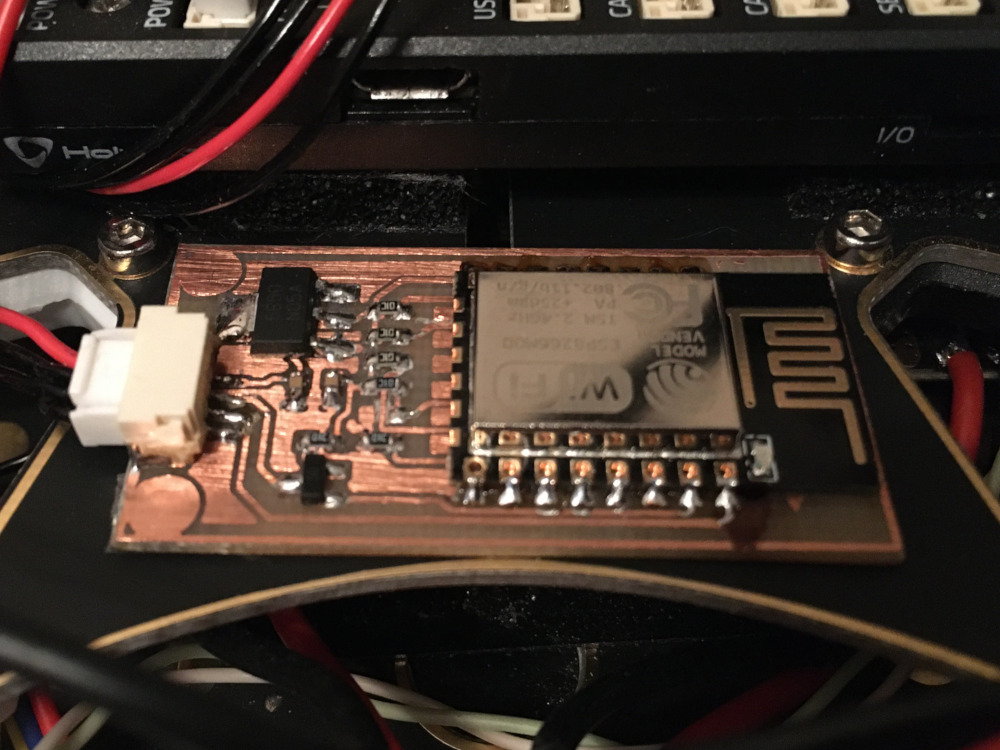

# Description

This is hardware adapter for ESP8266 (ESP12E). The project made in Eagle.

Feature:

- Tolerant to 3.3 - 5V power supply

Firmware: [dogmaphobic/mavesp8266](https://github.com/dogmaphobic/mavesp8266)

Example:

